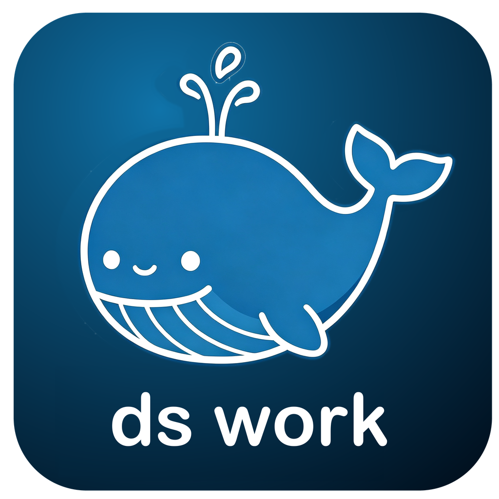
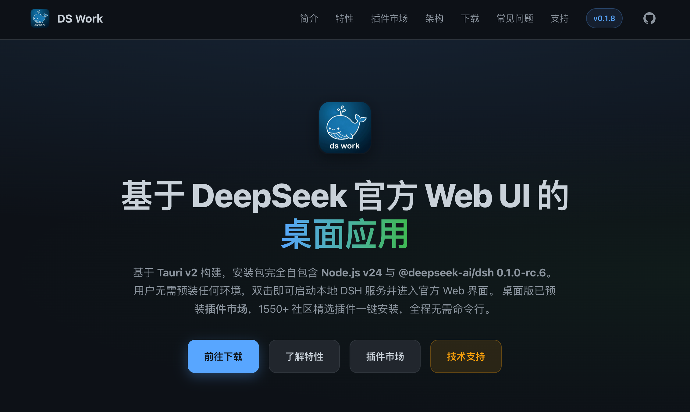

**English** · [中文](./README.md)

---

<div align="center">

# DeepSeek Work


基于 **Tauri v2** 的 DeepSeek 桌面 Agent。

桌面端作为 **DSH 官方 Web UI 的桌面壳**：启动时拉起本地 `dsh web` 子进程，待其就绪后把 Tauri 窗口导航到官方 Web 界面。

安装包**完全自包含**：内嵌 Node.js 运行时与 `@deepseek-ai/dsh` 完整依赖树，用户机器无需预装 Node.js / pnpm 或任何项目依赖。

增加插件市场，具体插件目录见：https://github.com/hotpot-labs/awesome-dsh-industry-plugins；

查看项目和下载：https://www.hotpotliuyu.com/ds-work/



</div>


## 技术栈

- Tauri v2
- React 18（仅用于启动加载页）
- Vite 7
- TypeScript 5.8
- `@deepseek-ai/dsh` `0.1.0-rc.6`（内嵌）

## 开发

```bash
# 安装依赖
pnpm install

# 准备内嵌运行环境（生成 src-tauri/runtime/，首次或 dsh 版本变化时执行）
bash scripts/prepare-runtime.sh

# 开发模式（热更新 + Tauri 窗口，debug 构建直接使用 src-tauri/runtime/）
pnpm tauri dev

# 仅前端开发服务器
pnpm dev
```

## 构建安装包

```bash
# 先准备内嵌运行环境（约 450 MB，会打进安装包）
bash scripts/prepare-runtime.sh

pnpm tauri build
```

`prepare-runtime.sh` 在临时目录用 pnpm hoisted 模式全新安装 `@deepseek-ai/dsh`（得到无符号链接的扁平依赖树），连同系统 Node.js 单文件二进制一起复制到 `src-tauri/runtime/`，并冒烟验证 `dsh web` 能独立启动。

构建产物：

- `src-tauri/target/release/bundle/macos/DeepSeek Work.app`（约 458 MB）
- `src-tauri/target/release/bundle/dmg/DeepSeek Work_0.1.0_aarch64.dmg`（约 99 MB）

## 发布（GitHub Releases）

安装包体积大（dmg 约 99 MB），不入库，统一通过 GitHub Releases 分发。两种方式：

**CI 发布（推荐）**：`.github/workflows/release.yml` 在打 tag 时自动并行构建 macOS（`macos-latest`，产出 dmg）和 Windows（`windows-latest`，产出 NSIS 安装程序 exe），并上传到同一个 Release：

```bash
git tag v0.1.0 && git push origin v0.1.0
```

**本地发布**：`scripts/release.sh` 在本机完成同样流程并调用 `gh` 创建 Release（需先 `brew install gh && gh auth login`）：

```bash
bash scripts/release.sh          # 按当前版本号发布
bash scripts/release.sh patch    # 先 bump 补丁版本（同步 tauri.conf.json 与 Cargo.toml）再发布
```

两种方式都会把产物同步复制到 `dist-desktop/`（该目录已 gitignore）。

## 功能

- **完全自包含**：内嵌 Node.js v24 与 DSH 全部依赖，无需用户预装任何环境
- **首次启动自动解包**：把运行环境复制到 `~/Library/Application Support/com.deepseek-harness.desktop/runtime`（APFS clone 秒级完成；DSH 版本升级时自动重新解包）
- 启动加载页为 spinner + 状态文字（「正在准备运行环境…」→「正在启动 DSH 服务…」），出错时显示错误与「重试」按钮
- 运行环境就绪后自动拉起 `dsh web` 子进程（`--port 0` 自动分配端口）
- 解析 stdout 中的 `dsh web: http://127.0.0.1:<port>` 就绪信号
- 窗口自动导航到官方 DSH Web UI
- **错误日志**：启动/运行中的错误（运行环境解包失败、DSH 启动失败、DSH 子进程 stderr 输出、DSH 异常退出）追加写入 `~/deepseek-work-preview/deepseek-work.log`（目录不存在自动创建，带时间戳）
- 托盘驻留：关闭窗口时应用保持运行，点击托盘图标恢复
- 托盘菜单支持「显示窗口 / 重启 DSH / 退出」
- IPC 命令：`get_dsh_status`、`start_dsh_service`、`stop_dsh_service`、`restart_dsh_service`

## 应用逻辑

### 整体启动流程

1. Tauri `setup` 阶段：构建托盘菜单（显示窗口 / 重启 DSH / 退出）、注册「关闭窗口即隐藏」行为，并在异步任务中执行启动序列；前端 `App.tsx` 同时通过 `invoke('start_dsh_service')` 触发同一流程——两条路径幂等，`AppState` 中的锁保证只执行一次
2. `ensure_runtime`：检查 App 数据目录下 `runtime/dsh-version` 标记与内嵌版本是否一致；不一致（首次启动或升级）则把 `.app/Contents/Resources/runtime/` 复制到可写的 App 数据目录（优先 APFS `cp -Rc` clone，失败回退递归拷贝），随后补 node 可执行权限并移除 quarantine 属性
3. `spawn_dsh_web`：用解包目录中的 node 拉起 `<runtime>/node_modules/@deepseek-ai/dsh/lib/bin.js web --port 0`，后台线程持续读取 stdout，解析到 `dsh web: http://127.0.0.1:<port>` 就绪信号后，将 Tauri 窗口 `navigate()` 到官方 Web UI，并向前端发出 `dsh-ready` 事件
4. 前端收到 `dsh-ready` 后也会自行 `window.location.href` 跳转，并每 500ms 轮询 `get_dsh_status` 兜底——dev 模式下 vite 首次编译慢，页面可能错过后端发出的事件和导航，两条自愈路径保证最终一定会进入 Web UI

### 启动加载页

- 无进度条：spinner + 一行状态文字，由后端 `boot-status` 字符串事件驱动（「首次启动，正在准备运行环境…」「正在启动 DSH 服务…」等）
- 页面检测不到 Tauri 运行环境时（例如在普通浏览器中打开 vite 开发地址）显示提示而非裸报错
- 出错时收到 `dsh-error` 事件，显示错误信息与「重试」按钮，点击后调用 `restart_dsh_service`（会重新走 `ensure_runtime` + 拉起子进程）

## 运行要求

无。安装包自包含 Node.js 与 DSH 运行时：

- **macOS**：首次启动解包运行环境到 `~/Library/Application Support/com.deepseek-harness.desktop/runtime`（约 450 MB）。应用未做 Apple 公证，从浏览器下载的 dmg 安装后首次打开可能提示「"DeepSeek Work"已损坏，无法打开」——这是 Gatekeeper 的隔离属性所致，在终端执行一次 `xattr -cr /Applications/DeepSeek\ Work.app` 后即可正常打开
- **Windows**：NSIS 安装包（`DeepSeek Work_<version>_x64-setup.exe`）；首次启动解包运行环境到 `%APPDATA%/com.deepseek-harness.desktop/runtime`；应用未签名，SmartScreen 提示时选「仍要运行」。若启动报「拒绝访问 (os error 5)」，通常是杀毒软件拦截了内嵌的 node.exe，请将安装目录或 `%APPDATA%/com.deepseek-harness.desktop` 加入杀软白名单

```bash
open dist-desktop/DeepSeek\ Work.app
```

## 项目结构

```
.
├── src/                    React 启动加载页
│   ├── App.tsx             spinner 状态页与 DSH 事件监听
│   ├── App.css             启动页样式
│   └── main.tsx            入口
├── src-tauri/              Tauri / Rust 后端
│   ├── src/lib.rs          运行环境解包、DSH 子进程管理、托盘、IPC
│   ├── runtime/            prepare-runtime.sh 产物（gitignore，打包进 .app）
│   ├── tauri.conf.json     Tauri 配置（bundle.resources 引用 runtime/）
│   └── Cargo.toml          Rust 依赖
├── scripts/
│   ├── prepare-runtime.sh  生成自包含运行环境（Node + DSH 依赖树）
│   └── release.sh          本地一键构建并发布 GitHub Release
├── .github/workflows/
│   └── release.yml         打 tag 触发 CI 构建并发布 Release
├── dist-desktop/           已构建的安装包
├── implement-plan.md       实施规范参考文档
└── README.md               本文件
```

## 许可证

本项目基于 [MIT](LICENSE) 协议发布。

本项目基于 [DeepSeek Harness](https://github.com/deepseek-ai/deepseek-harness)（`@deepseek-ai/dsh`，MIT，Copyright (c) 2026 DeepSeek）实现：安装包内嵌其完整运行时，桌面窗口展示的即 DSH 官方 Web UI，应用图标复用了 DSH 的鲸鱼 logo。

第三方组件及其协议声明见 [THIRD_PARTY_NOTICES.md](THIRD_PARTY_NOTICES.md)。
